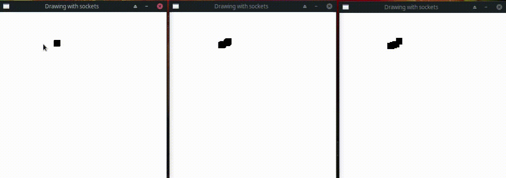

Anderson Cardoso Gonçalves 11208610

Manjaro 21.0.6 - Linux 5.4.123-1

GCC 11.1.0

SDL2 é necessário para compilar

make run para executar

|Lado|Comando|Efeito|
|:--:|:-----:|:----:|
Servidor|exit|Termina o servidor
Servidor|data|Alterna mostrar dados
Servidor|clients|Mostra o estado dos clientes
Cliente|Botão Mouse Esquerdo|Desenha na tela
Cliente|Dígitos 1~5|Altera Cor
Cliente|Tecla Q|Aumenta tamanho do pincel
Cliente|Tecla W|Diminuí tamanho do pincel

